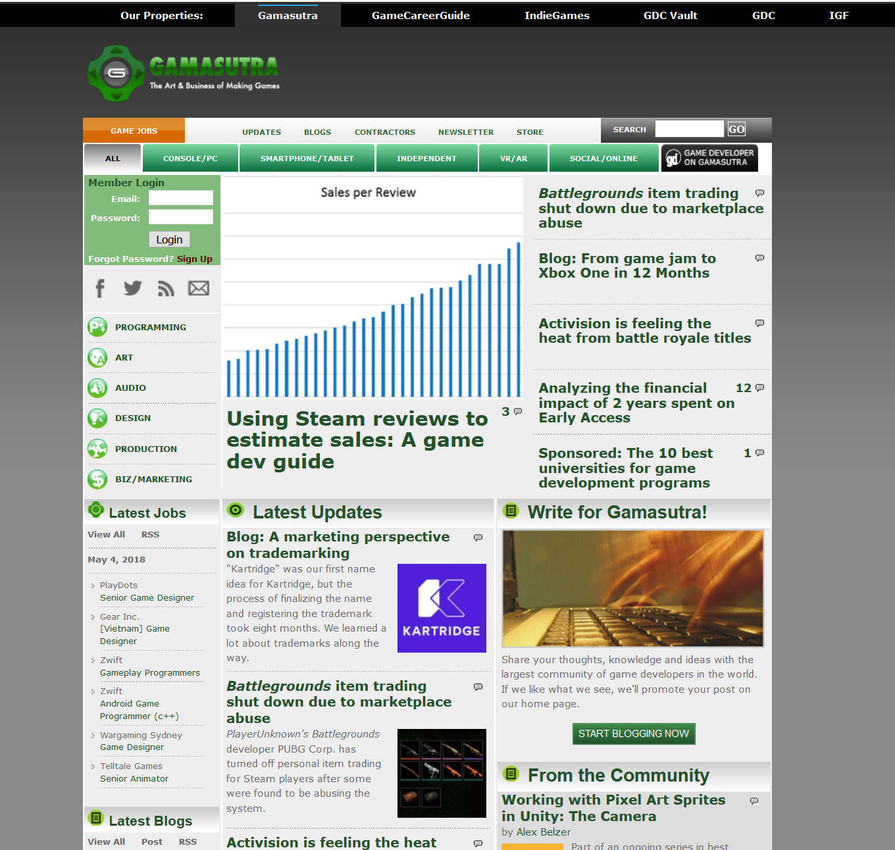
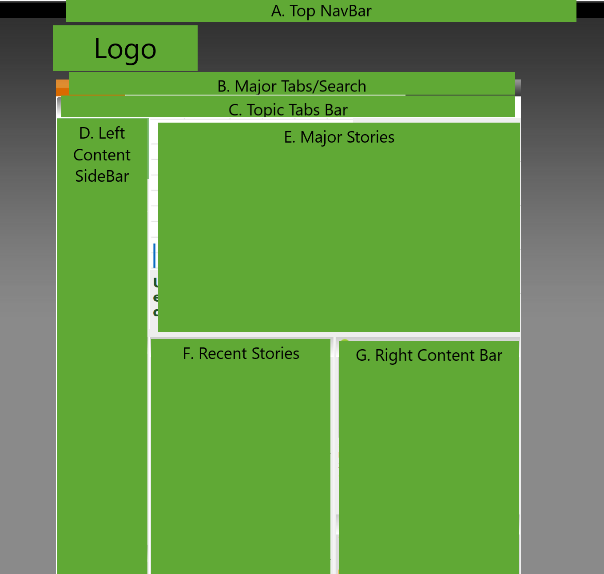
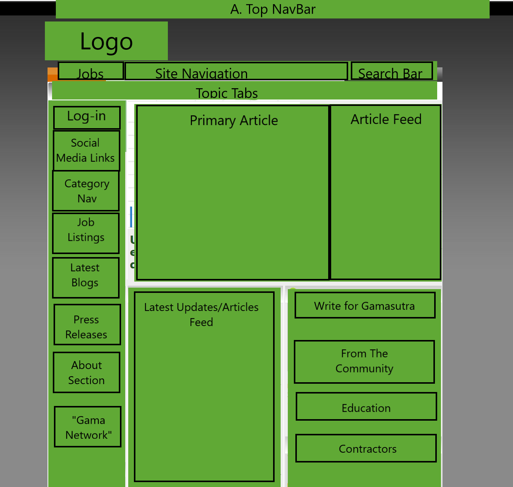

# GamasutraClone

This project was generated with [Angular CLI](https://github.com/angular/angular-cli) version 1.6.5.

#### _Gamasutra Clone_

#### By: _**Kayl Eubanks**_

## Description

_This webpage application is a clone of the website http://www.gamasutra.com._

## Setup/Installation Requirement

* Clone repository on your local computer from https://github.com/K-Banks/gamasutra-clone.
* If you already have Node, Homebrew, Karma, and Angular installed, then skip to "Install Dependencies."

  #### Node: Windows / Linux Installation Instructions
  * To install Node on other systems, go to the <a href="https://nodejs.org/en/">Node website</a>, download and install the appropriate installer for your operating system.

  #### Node: OSX Installation Instructions
  * On OS X systems, install Node.js through Homebrew with the following command in your home directory:
    * $ brew install node
  * Confirm that node and npm (node package manager, installed automatically with Node) are in place by checking the versions (Node should be 4.0.x or higher, npm should be 3.6.x or higher):
    * $ node -v
    * $ npm -v

  #### Homebrew Installation
  * If you do not have Homebrew installed yet, you may install it by copying and pasting this command:
    * $ /usr/bin/ruby -e "$(curl -fsSL https://raw.githubusercontent.com/Homebrew/install/master/install)"
  * Next, ensure Homebrew packages are run before the system versions of the same (which may be dated or not what we want) by executing the following:
    * $ echo 'export PATH=/usr/local/bin:$PATH' >> ~/.bash_profile

  #### Karma Installation
  * If you do not have Karma installed globally, then run the following:
    * $ npm install -g karma-cli

  #### Angular Installation
  * If you do not have Angular installed globally, then run the following:
    * $ npm install -g @angular/cli@1.6.5

  #### Install dependencies
  * Enter the following code in the command line to install all dependencies:
    * $ npm install

  #### Working with the project in command line:
  * To build and observe the app on a local host:
    * $ ng serve --open

## Known Bugs

_No known bugs at this time._
_Please contact author at kayleubanks@gmail.com with any bugs._

## Technologies Used

| Development dependencies | Front end dependencies |
| :------------ | :------------- |
| * webpack | * bootstrap |
| * eslint | * jquery |
| * karma & jasmine | * popper
| * babel-loader |  |
| * css-loader & style-loader | |
| * dot-env |  |
| * Angular |  |

### Specs
  * User will be able to navigate to other UBM TechWeb properties from top nav bar.
  * User will be able to click on article titles for links to those articles.
  * User will be able to navigate to social media pages for Gamasutra.
  * User will be able to filter articles by relevant categories (ex: Programming, Art, Audio, ect.).
  * User will be able to filter articles by relevant topics (ex: Console/PC, Smartphone/Tablet, VR/AR, ect.).
  * User will be able to search articles using their own keywords.

### Project Planning
  * example of Gamasutra landing page:
    * 

  * Plan of major component layout for webpage:
    * 

  * Plan of subcomponents layout:
    * 

  

### License

This software is licensed under the MIT license.

Copyright (c) 2018 ****_Kayl Eubanks_****
